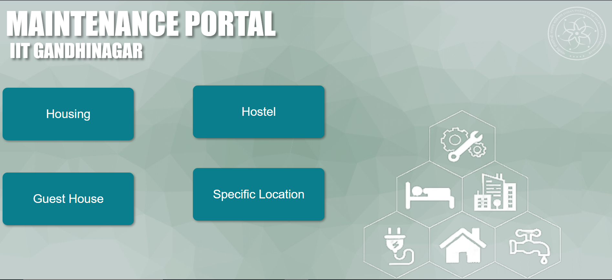
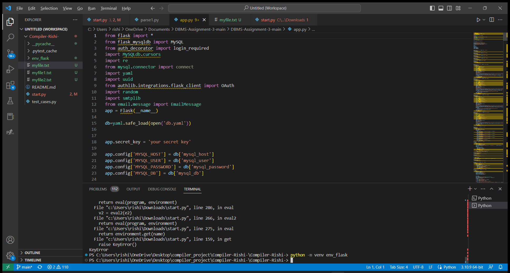
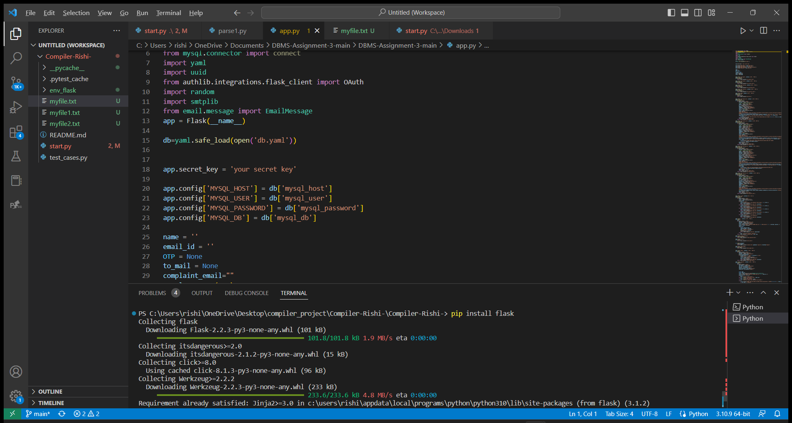
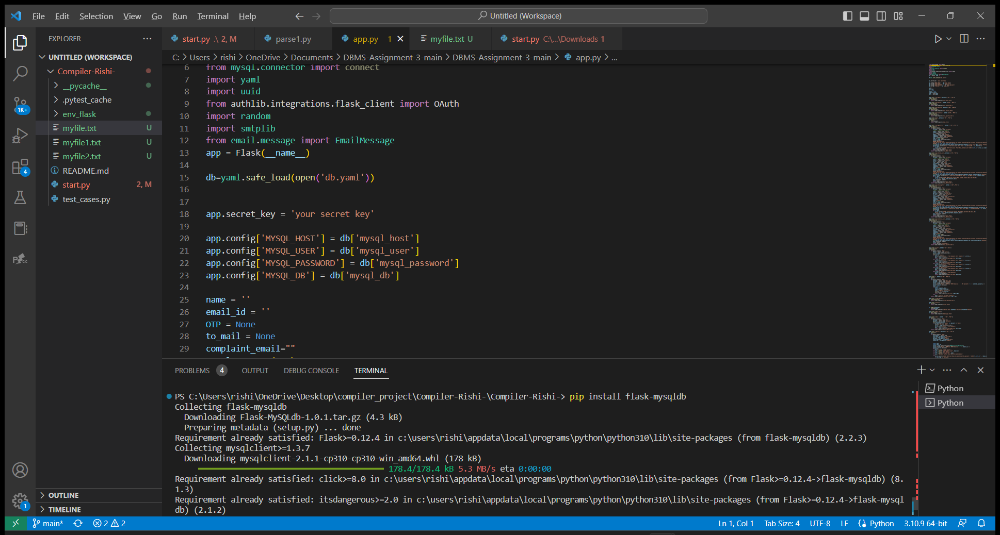
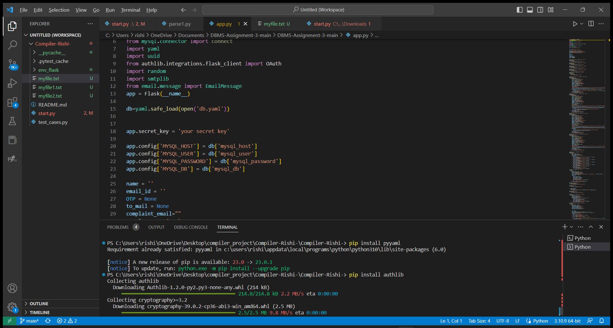
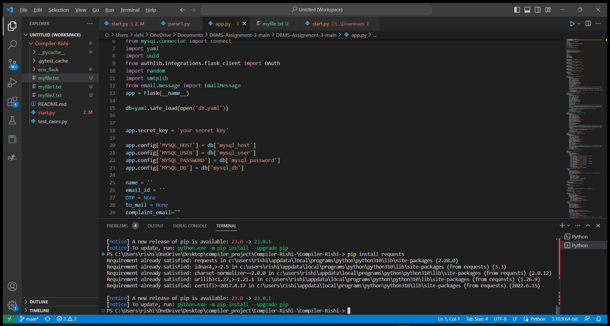
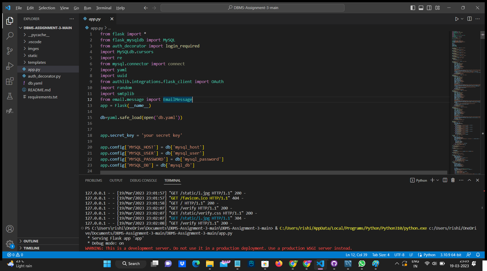
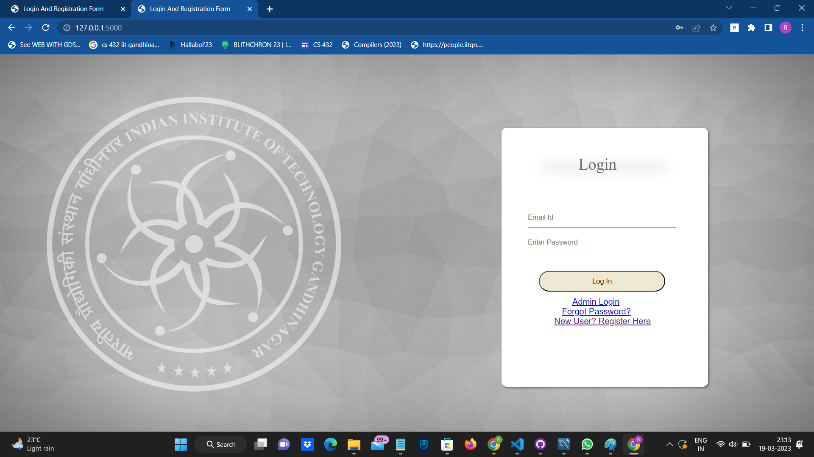
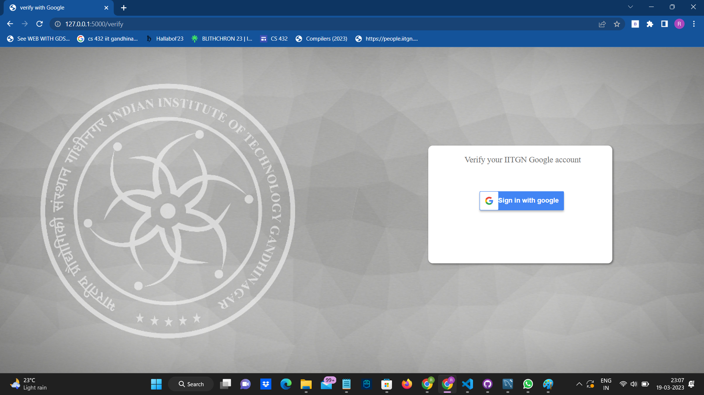
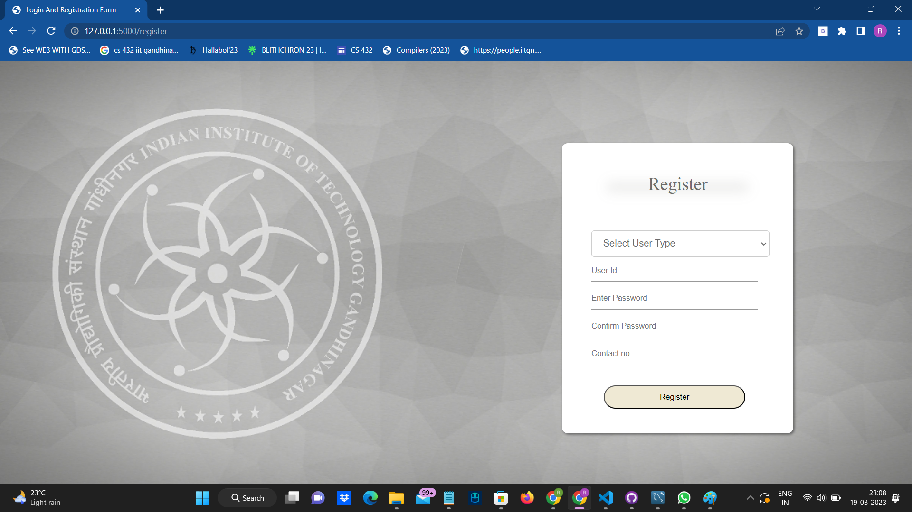

# Assignment-3

# Project Title:-

 **Maintenance Portal**

# Project Description:-
Our Project:<b>"Maintenance Portal of IIT Gandhinagar"</b> is a web-based platform that enables students  , staff members to report about issues and also track maintenance requests for the campus facilities. It is designed to streamline the process of submitting maintenance requests and improve the overall maintenance workflow.  

In our platform the users can access the portal through a web browser and login using their IIT Gandhinagar email credentials. Once logged in, web application will redirect to home page that contain options for housing, hostel,guest house and specific location. they can submit a maintenance request by filling out an online form that includes details such as the location of the issue, the type of problem, and a brief description of the issue.

Once a maintenance request is submitted, it is assigned a unique tracking number, and the user can track the status of their request through the portal.status of the request could be pending,Done,In progress. The maintenance team is notified of the request and will work on resolving the issue as soon as possible.
a Admin login link has been provided on login page.
Admin can login using one unique username and password.Once logged in admin can see all the complaints.

Users can also view the status of their previous maintenance requests.

The technology used for frontend: HTML, CSS, and JavaScript, whereas for the backend we have used MySQL and Flask.  

# Table of Content:

- [Assignment-3](#assignment-3)
- [Project Title:-](#project-title-)
- [Project Description:-](#project-description-)
- [Table of Content:](#table-of-content)
- [Installation](#installation)
- [Usage](#usage)
  - [User login/Register](#user-loginregister)
  - [Admin login :-](#admin-login--)
  - [Execution of Dynamic Operations](#execution-of-dynamic-operations)
  - [Admin can see the data as follows :-](#admin-can-see-the-data-as-follows--)
- [Contributions](#contributions)
- [References](#references)
# Installation
* **1:** Create Database using this [SQL File](maintenance_portal.sql)
    * In  **db.yaml** file in password field you have to change according to your Mysql server password.

* **2:** Requirement for project installation:
  * a: Setting the enviroment using the following command-
    * For Windows:  python -m venv evn_flask
    * For Ubuntu/Mac: python3 -m venv evn_flask
    
    

  * b: Installing the packages:
    * pip install flask

    

    * pip install flask-mysqldb
    
    

    * pip install pyyaml

    

    * pip install authlib
    
    

    * pip install requests
  
  

  # Usage
  ***
  ## User login/Register
  * The new user have to register himself first google authentication has been used to authenticate whether the user belongs to IIT Gandhinagar community or not.Then user can register him/herself by providing some basic information .
  
      
        
        

## Admin login :-
  * The website contain link for the admin login in which we can login by giving following credentials :-
  
  * **user_id= admin**
  * **password = pass**  

## Execution of Dynamic Operations

- [x] insert
- [ ] update
- [ ] delete
- [ ] rename
- [x] where clause
  
  * complaint about the electricity in the hostel room
   
   

  * complaint successful
    

* The database table before the complaint 

* The database after the complaint

- [ ] insert
- [x] update
- [ ] delete
- [ ] rename
- [ ] where clause

* updating password of user

* updating new password

* database table before password update

* Otp send by server
  

* Password change succesful
  

* updated database table after password change
  

## Admin can see the data as follows :-

# Contributions

* Responsibility of Group G1 :- Frontend development using html ,css ,javascript. followings are contributors 
  
    * Prajwal Jivtode 
    * Rishi Katkar 
    * Onkar Mishra
    * Priyanshu Mishra
    * Madhuri Awachar
    * Pooja Goel  
    * Pinki Kumari
  
* Responsibility of Group G2 :- All the Backend work including database conectivity using python, mysql and flask.
    
    * Sai Krishna Avula
    * Ritesh Patidar
    * Sujeet Kumar Yadav
    

* Responsibility of both G1 and G2 :- Creation of database of the maintenance portal of IIT Gandhinagar

# References

* [Geeksforgeeks](https://www.geeksforgeeks.org/profile-application-using-python-flask-and-mysql/)

* [Flask_documentation](https://flask.palletsprojects.com/en/2.2.x/)

  

  

